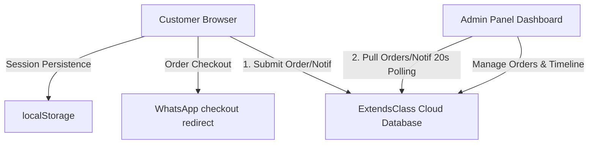

# Boran Trends - Boutique Storefront & Admin Dashboard

Boran Trends is a premium, responsive e-commerce web application featuring a boutique storefront for customers and a comprehensive management panel for administrators. It is built as a self-contained, serverless client-side application that supports cross-device order placement, notifications, and catalog management.

---

## 🏗️ Architecture Design

The platform is designed around a modern **Serverless Client-Side Single Page Application (SPA)** architecture. It utilizes local browser persistence paired with an anonymous cloud data-sync layer to coordinate state across different devices and user sessions.



### 1. Global State Orchestration (`ShopContext`)
All global states—including product catalog, shopping cart, user profiles, active user sessions, orders, and notifications—are managed using **React's Context API**. This serves as the single source of truth for the entire application.

### 2. Authorization & Routing Gate (`App.jsx`)
The application features a strict conditional routing system that intercepts access based on authentication status and roles:
* **Unauthenticated Guests**: Locked out of both storefront and admin pages and redirected to `/login`.
* **Authenticated Customers**: Allowed access to the storefront `/` (Home, Shop, Cart, Wishlist, Profile). Restricted from entering `/admin/*` dashboards.
* **Authenticated Admins**: Automatically routed to the `/admin/products` dashboard and restricted from customer storefront interactions.

### 3. Cloud Data Synchronization (Serverless Tier)
Instead of relying on a dedicated Node.js/Express server and MongoDB instance, the application implements a serverless database tier:
* **Database Engine**: Uses **ExtendsClass**, a secure, CORS-friendly JSON storage API.
* **Real-time Sync**:
  * **Customers**: Fetch the central database on page mount to load existing order histories and push updates on order placement.
  * **Administrators**: Run a background polling cycle (every 20 seconds) while active on the dashboard to dynamically fetch new orders and notifications placed from any device or account.
* **Redirection Race Condition Prevention**: Order placement is fully asynchronous, meaning the application awaits confirmation from the cloud database before redirecting the customer to WhatsApp.

---

## 🛠️ Technology Stack & Dependencies

* **Core UI Engine**: [React](https://react.dev/) (Functional components with hooks).
* **Build System**: [Vite](https://vite.dev/) (Providing fast compilation and optimized production bundles).
* **Styling**: [TailwindCSS](https://tailwindcss.com/) (For responsive, modern utility classes and layouts).
* **Routing**: [React Router DOM v6](https://reactrouter.com/) (Managing declarative route configuration and auth gates).
* **Icons**: [Lucide React](https://lucide.dev/) (For clean vector graphics).
* **Cloud Sync API**: [ExtendsClass REST API](https://extendsclass.com/) (Providing shared JSON storage).

---

## ✨ Key Features

### 🛍️ Customer Storefront
* **Dynamic Catalog**: Category filtering (Shirts, Trousers, Blazers, T-Shirts, Suits), sizes, colors, and search capabilities.
* **Shopping Cart & Wishlist**: Persistent cart items and wishlist saves.
* **WhatsApp Checkout**: Formats order specifications and redirects the customer to a pre-filled click-to-chat link.
* **User Profile**: Management of delivery details and order history.
* **Forced Login Screen**: Secure authentication barrier on entry.

### 💼 Admin Dashboard Panel
* **Product Catalog Editor**: Add, edit, update stocks, colors, sizes, and upload images.
* **Manage Orders**: View details of all orders placed across all customer accounts.
* **Order Timeline**: Track and update order delivery phases (*Availability Confirmed, Packing, Dispatched, Out for Delivery, Delivered*).
* **Notification Feed**: Popup alert feed notifying admins of incoming orders in real time.
* **Business Analytics**: Track revenue metrics, item sales distribution charts, and order summaries.

---

## 🚀 Deployment & Installation

### Local Development
To run the project locally on your machine:

1. Clone the repository and navigate into the folder:
   ```bash
   cd clothing
   ```
2. Install the package dependencies:
   ```bash
   npm install
   ```
3. Run the Vite development server:
   ```bash
   npm run dev
   ```

### Production Build
To generate an optimized production bundle:
```bash
npm run build
```
This produces a static `dist` folder ready to be deployed to static hosting platforms such as Vercel, Netlify, or GitHub Pages.
